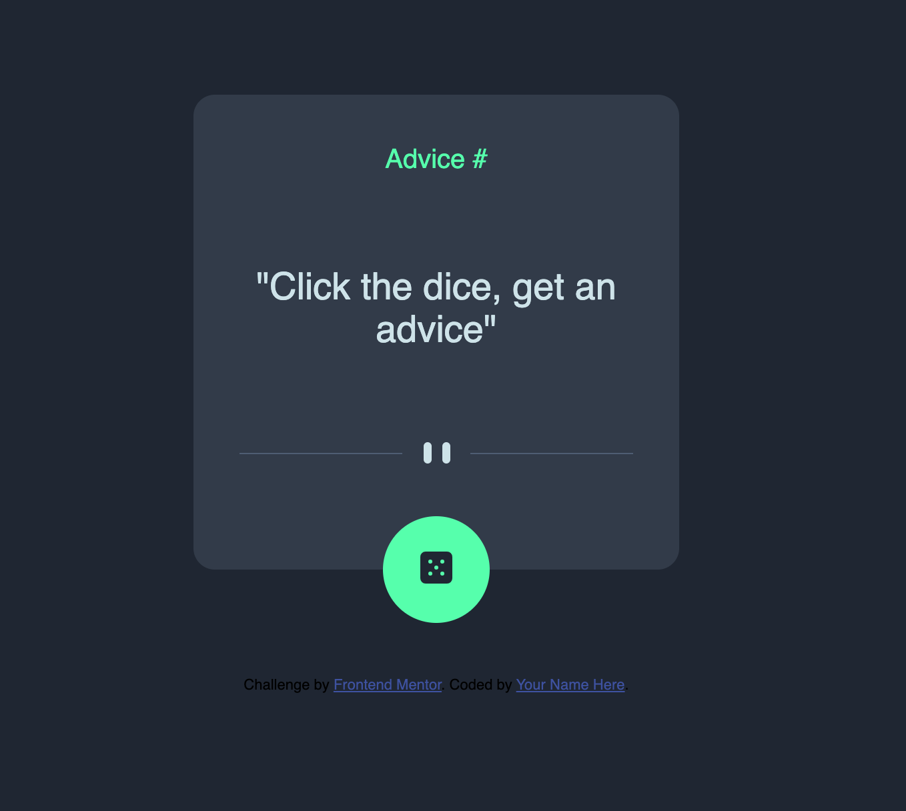

# Frontend Mentor - Advice generator app solution
## Table of contents

  - [Screenshot](#screenshot)
  - [Links](#links)
- [My process](#my-process)
  - [Built with](#built-with)
  - [What I learned](#what-i-learned)
  - [Continued development](#continued-development)

### Screenshot

### Links

- Solution URL: [Github](https://github.com/lingowmx/advice-app)
- Live Site URL: [Github Pages](https://lingowmx.github.io/advice-app/)

## My process
Once again i skip the important part of what the customer wants. In this case it was an easy practice just to remember how to call an API, but didnt check first the styles. 
First i create the html and css, applied the first general styles then call the api in js.
i look for an extra style to give a rotation to the dice bse the api says that will take 2 seconds between clicks so with that it is necessary to wait before another click
### Built with

- Semantic HTML5 markup
- CSS custom properties
- SASS
- Flexbox
- CSS Grid
- Mobile-first workflow

### What I learned
The use of & in sass and with the :hover. Looks like in some styles or elements it doesnt matter if it is before the :hover but in other is necessary

Use this section to recap over some of your major learnings while working through this project. Writing these out and providing code samples of areas you want to highlight is a great way to reinforce your own knowledge.

### Continued development

Keep practicing and being crative and curious

